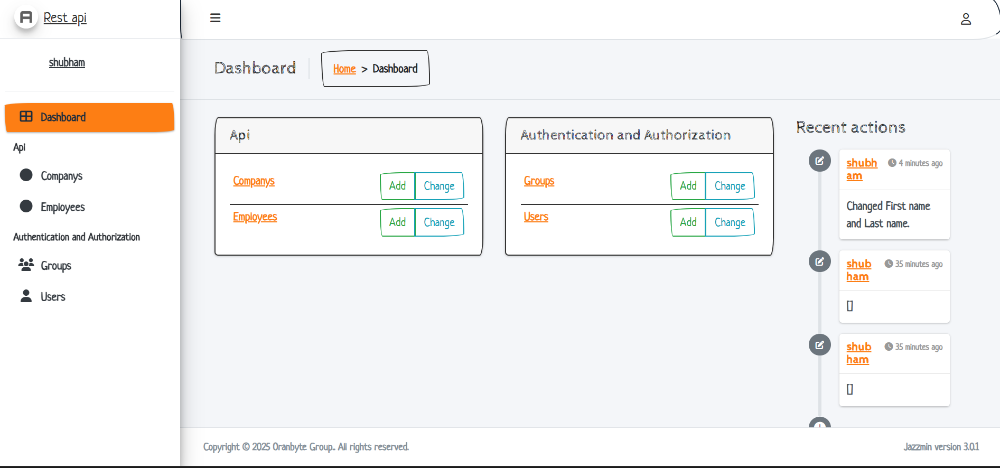

# Python + Django


<br />
<br />
<div align="center" style="display: flex;align-items: center; justify-content: center; width: 100%; gap: 10px">
<br />
<br />
</div>
<br />
<br />

### Some of important commands 

1. Check django install
```sh
python -m django --version
```
1. Create Django Project
```sh
django-admin startproject <project-name>
```

1. Start The server
```sh
python manage.py runserver
```

1. Migrate the database
```sh
python manage.py migrate
```

1. Create App
```sh
python manage.py startapp <app-name>
```

1. Create New Migrations
```sh
python manage.py makemigrations
python manage.py migrate
```

1. Create Admin dashboard
```sh
python manage.py migrate
python manage.py createsuperuser
```

1. Start shell
```sh
python manage.py shell
```

# Django rest page
- [Django_05_rest_2\README.md] (Django_04_rest_api/README.md) 


# customizing admin dashboard
1. install django-jazzmin
```py
pip install -U django-jazzmin
```

2. add to your apps
```py
INSTALLED_APPS = [
    'jazzmin',
    
    # other apps
]
```
3. ready to run
4. customization : [Django-jazzmin documentation](https://django-jazzmin.readthedocs.io/configuration/)
```py
JAZZMIN_SETTINGS = {
     "site_title": "Rest API Admin",
    'show_ui_builder' : True,
    ### other propertis available on docs
}
```

5. customized jazzmin dashboard : 
```py

JAZZMIN_UI_TWEAKS = {
    "navbar_small_text": False,
    "footer_small_text": False,
    "body_small_text": False,
    "brand_small_text": False,
    "brand_colour": "navbar-white",
    "accent": "accent-orange",
    "navbar": "navbar-white navbar-light",
    "no_navbar_border": False,
    "navbar_fixed": True,
    "layout_boxed": False,
    "footer_fixed": True,
    "sidebar_fixed": True,
    "sidebar": "sidebar-light-orange",
    "sidebar_nav_small_text": False,
    "sidebar_disable_expand": False,
    "sidebar_nav_child_indent": False,
    "sidebar_nav_compact_style": False,
    "sidebar_nav_legacy_style": False,
    "sidebar_nav_flat_style": False,
    "theme": "sketchy",
    "dark_mode_theme": None,
    "button_classes": {
        "primary": "btn-outline-primary",
        "secondary": "btn-outline-secondary",
        "info": "btn-outline-info",
        "warning": "btn-outline-warning",
        "danger": "btn-outline-danger",
        "success": "btn-outline-success"
    },
    "actions_sticky_top": False
} 
```

